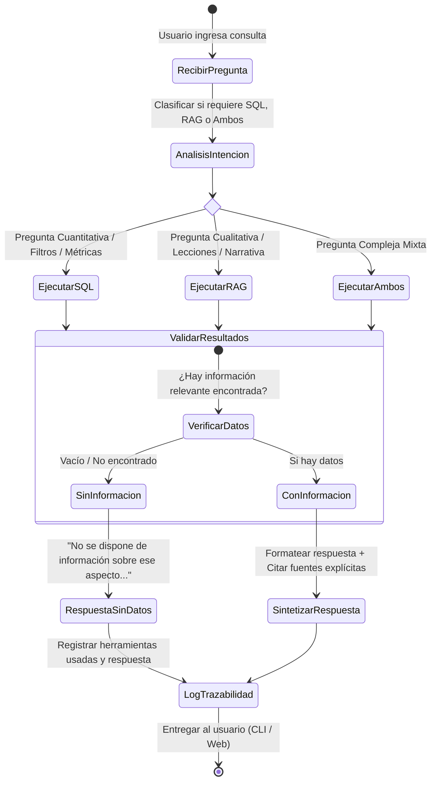

# Ciclo de Ejecución y Guardrails del Agente (Agent Loop)

Este documento define el ciclo de razonamiento y validación del agente para responder consultas de manera determinista y sin alucinaciones.

---

## 🔄 Diagrama del Ciclo de Ejecución (ReAct Loop)

---

## 🛡️ Guardrails y Verificaciones en Cada Paso

| Fase | Regla de Control | Acción en caso de Fallo |
| :--- | :--- | :--- |
| **1. SQL Query** | Solo sentencias `SELECT`. Prohibido `INSERT`, `UPDATE`, `DELETE`, `DROP`. | Rechazar la consulta antes de ejecutar y registrar advertencia. |
| **2. RAG Retrieval** | Limitar a fragmentos con score de relevancia suficiente sobre los 4 informes. | Si el score es bajo, no inventar contexto. |
| **3. Síntesis** | Verificar que cada afirmación tenga su cita `[Fuente: Codigo - Proyecto]`. | Si falta la fuente, no incluir la afirmación. |
| **4. Anti-Alucinación** | Si el resultado de las herramientas está vacío, responder que no hay información. | Prohibido usar conocimiento general del LLM no respaldado en los informes. |
