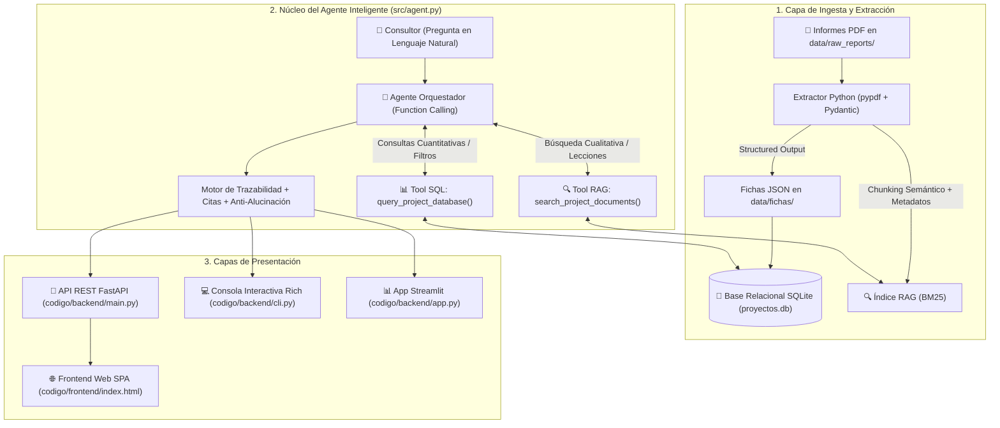

# 🏢 Procesa Consultores - Agente de Consulta de Proyectos Históricos

Sistema de consulta de proyectos y documentos PDF. Admite facturas, contratos, manuales e informes mediante un catálogo documental independiente, además de conservar SQL para los proyectos de consultoría. El contenido de los archivos cargados se recupera con citas por documento y página.

## PDFs de distintos tipos y carga múltiple

Actualización de OpenAI: se corrigió una limitación de la ingesta que todavía exigía Gemini para escaneados. Las 42 pruebas automatizadas pasan, incluido el contrato REST de GPT-4o mini, campos estructurados, lectura visual y aislamiento de fuentes. La primera prueba real de factura con OpenAI respondió USD 23.00 con cita correcta. La validación real posterior con GPT-4o mini obtuvo 18 de 19 comprobaciones: siete cargas con OpenAI y consultas correctas sobre factura, contrato, manual, tabla, escaneado, PDF mixto y un dato en la página 12. El escaneado se leyó realmente mediante `openai_pdf`. La comparación original fue rechazada por el control de cifras, aunque una variante con viñetas sin numeración respondió correctamente con ambas fuentes. No se certifica comprensión universal. Evidencia: `CHATGPT QA/openai_real/resultados.json` y `comparacion_reintento.json`. La selección de proveedor y la clave cargadas en `/api/config` son temporales y deben configurarse de nuevo si se reinicia el proceso.

La carga ya no convierte todos los PDFs en proyectos: guarda cada archivo en la tabla `documentos` de SQLite, con identidad `DOC-…` basada en su contenido, páginas, tipo y campos extraídos. Dos archivos distintos con el mismo nombre conservan identidades diferentes; una carga repetida del mismo contenido devuelve la identidad existente. El índice documental se actualiza después de cada carga.

En la aplicación se pueden cargar varios PDFs en el diálogo de carga o arrastrarlos al chat. El selector «Seleccionar documentos para consultar o comparar» permite delimitar las fuentes. Las citas abren el archivo correspondiente, su texto por página y los campos extraídos. Los errores de API se muestran como errores; no se sustituyen por respuestas de los cuatro documentos de demostración.

Configura Gemini u OpenAI (`gpt-4o-mini`) en **Config** para clasificación, extracción visual y respuestas sintetizadas. OpenAI recibe texto en los documentos legibles y únicamente las páginas sin texto para lectura visual; las consultas posteriores usan fragmentos del índice, sin reenviar el PDF. El backend envía el PDF al proveedor configurado para su lectura visual. Sin clave, los PDFs con texto seleccionable siguen disponibles en modo extractivo, identificado expresamente en la respuesta. Los PDFs escaneados requieren el proveedor configurado operativo o un OCR previo; una lectura fallida se rechaza con un mensaje claro. El límite por archivo es 15 MiB y 200 páginas, y cada consulta permite seleccionar hasta 20 documentos.

Para iniciar con un catálogo vacío, establece `PROCESA_SEED_OFFICIAL=0` y `PROCESA_DATA_DIR` apuntando a una carpeta nueva antes de iniciar el backend. La opción no elimina datos existentes. `GET /api/documentos` lista documentos generales; `POST /api/chat` acepta `document_ids`; los PDFs y vistas previas conservan las rutas existentes con el nuevo identificador.

En Vercel, `/tmp` es temporal: esta versión procesa nuevos documentos dentro de la instancia activa, pero no ofrece conservación entre reinicios ni sincronización entre instancias. Para uso persistente, configura un backend con disco/volumen persistente mediante `PROCESA_DATA_DIR` y su URL en la interfaz. No se ha desplegado ese servicio como parte de esta corrección.

Validación de esta ampliación: **42 pruebas Python aprobadas**, **6 verificaciones del cliente web aprobadas**, compilación Vite y comprobación en navegador de factura + contrato con evidencia. Se verificó también el inicio sin ningún informe oficial. La verificación posterior con la clave Gemini del backend activo obtuvo 8 de 10 comprobaciones funcionales: dos documentos se extrajeron con Gemini, pero hubo errores HTTP 503 y 429. El escaneado falló y algunas consultas usaron extractos locales; por tanto, la operación completa con IA permanece sin aprobar. Se añadieron reintentos limitados para errores temporales y diagnósticos que no exponen credenciales. Resultados reales: `CHATGPT QA/gemini_real/resultados.json` y `reintento_escaneado_final.json`. Estos resultados no certifican exactitud universal de OCR, interpretación semántica o cálculos. Los resúmenes usan fragmentos recuperados, que pueden ser parciales en archivos largos. Evidencia: `CHATGPT QA/suite_documentos.log`, `suite_documentos.xml`, `prueba_ui_documentos.json` y `prueba_sin_oficiales.json`.

---

## 📑 Tabla de Contenidos
1. [Contexto y Problemática](#1-contexto-y-problemática)
2. [Arquitectura de la Solución](#2-arquitectura-de-la-solución)
3. [Estructura del Proyecto](#3-estructura-del-proyecto)
4. [Instalación y Despliegue Rápido](#4-instalación-y-despliegue-rápido)
5. [Guía de Uso (CLI y Web App)](#5-guía-de-uso-cli-y-web-app)
6. [Justificación del Esquema de Ficha de Proyecto](#6-justificación-del-esquema-de-ficha-de-proyecto)
7. [Mecanismos de Confiabilidad, Trazabilidad y Anti-Alucinación](#7-mecanismos-de-confiabilidad-trazabilidad-y-anti-alucinación)
8. [Estimación de Costos de Operación (50 Consultores / Día)](#8-estimación-de-costos-de-operación-50-consultores--día)
9. [Supuestos y Limitaciones Conocidas](#9-supuestos-y-limitaciones-conocidas)
10. [Batería de Pruebas Automatizadas](#10-batería-de-pruebas-automatizadas)
11. [Propuesta de Integración con SharePoint y Power BI](#11-propuesta-de-integración-con-sharepoint-y-power-bi)

---

## 1. 🏢 Contexto y Problemática

**Procesa Consultores** ejecuta proyectos de optimización de procesos en diversos sectores (Servicios Financieros, Manufactura, Salud y Retail). Al concluir cada proyecto se genera un informe de cierre con metodologías, métricas de impacto y lecciones aprendidas. Sin embargo, estos informes quedan archivados en carpetas estáticas.

Este agente permite a cualquier consultor realizar preguntas en lenguaje natural y obtener respuestas inmediatas, cuantitativamente precisas y respaldadas por citas del informe original.

### Proyectos Históricos Incorporados:
* **`PC-2025-014`**: *Cooperativa de Ahorro y Crédito Horizonte Andino Ltda.* (Servicios Financieros - Aprobación de créditos).
* **`PC-2025-027`**: *Plásticos del Pacífico S.A.* (Manufactura - Mejora de OEE en planta industrial de Durán).
* **`PC-2025-033`**: *Clínica Santa Lucía del Valle* (Salud - Reducción de tiempos de admisión y espera en consulta externa).
* **`PC-2026-006`**: *Supermercados La Canasta Cía. Ltda.* (Retail - Reposición de inventario en tiendas).

---

## 2. 🏗️ Arquitectura de la Solución

El sistema se diseñó bajo una arquitectura **Modular y Desacoplada** en Python, combinando dos herramientas especializadas mediante **OpenAI Function Calling**:



### ¿Por qué esta arquitectura?
1. **Separación de Responsabilidades:** Las preguntas cuantitativas (duraciones, conteos, ordenamientos) se resuelven mediante **SQL exacto** (evitando errores de cálculo del LLM), mientras que las preguntas cualitativas (lecciones, metodología, liderazgo) se resuelven mediante **RAG documental**.
2. **Control Total y Extensibilidad:** No depende de frameworks monolíticos "caja negra" (como CrewAI o AutoGen), lo que garantiza máxima velocidad, código testeable y facilidad para aplicar cambios en vivo durante la evaluación técnica.

---

## 3. 📁 Estructura del Proyecto y Guía para el Evaluador (RH / Tech Lead)

Para facilitar la navegación y comprensión del proyecto, la arquitectura se divide limpiamente en carpetas con responsabilidades únicas:

```
Talen GV/
├── agent/                          # Prompts del sistema, arquitectura ReAct y especificaciones del agente
│   ├── README.md                   # Mapeo maestro de recursos
│   ├── system_prompt.md            # Directivas inviolables y reglas anti-alucinación
│   ├── agent_loop.md               # Máquina de estados y guardrails
│   ├── prompts/                    # Prompts del sistema, extractor y generador SQL
│   └── skills/                     # Skills especializadas (extracción, BD, RAG, CLI, tests)
├── bitacora/                       # Guías paso a paso para la sustentación de la entrevista
│   ├── 01_estructura_y_git/        # Configuración inicial y repositorio
│   ├── 02_extraccion_pydantic_sqlite/ # Pipeline de extracción e ingesta relacional
│   ├── 03_motor_rag/               # Motor de búsqueda semántica e indexación
│   ├── 04_agente_y_herramientas/   # Orquestador ReAct y Function Calling
│   ├── 05_interfaces_cli_web/      # Despliegue de interfaces CLI y Web
│   └── 06_pruebas_y_costos/        # Batería de pruebas y memoria de costos (50 usuarios)
├── extracted/                      # Archivos originales e insumos extraídos del ZIP
│   ├── Informe_Cierre_PC-2025-014...pdf
│   ├── Informe_Cierre_PC-2025-027...pdf
│   ├── Informe_Cierre_PC-2025-033...pdf
│   ├── Informe_Cierre_PC-2026-006...pdf
│   └── Prueba_Tecnica_Consultor_IA.pdf # Enunciado oficial de la prueba técnica
├── notas-agente/                   # Notas de análisis del problema y solución técnica
│   ├── problematica.md             # Desglose de retos y requerimientos
│   └── solucion.md                 # Enfoque de ingeniería y comparativa de soluciones
├── codigo/                         # 💻 NÚCLEO OPERATIVO: Todo el código fuente de la aplicación
│   ├── backend/                    # Servidor API REST FastAPI, Base de datos y Agente de IA
│   │   ├── main.py                 # FastAPI endpoints (/api/chat, /api/proyectos, /api/sql)
│   │   ├── agent.py                # Orquestador con Function Calling (Gemini Flash)
│   │   ├── database.py             # SQLite DatabaseManager con guardrails de seguridad
│   │   ├── extractor.py            # Pipeline PDF -> Pydantic -> JSON / SQLite
│   │   ├── models.py               # Esquemas Pydantic v2 (ProyectoFicha, KPIImpacto)
│   │   ├── rag.py                  # Motor de búsqueda documental BM25 con chunking
│   │   ├── cli.py                  # Consola interactiva moderna con Rich
│   │   ├── app.py                  # Aplicación Streamlit alternativa
│   │   └── config.py               # Rutas y variables de entorno
│   └── frontend/                   # ⚛️ APLICACIÓN WEB REACT + VITE + TAILWIND CSS
│       ├── src/                    # Componentes React (ChatView, FichasView, SqlExplorerView, etc.)
│       │   ├── components/         # Sidebar, Header, Modales de Configuración y Subida
│       │   ├── services/api.js     # Cliente API REST desacoplado
│       │   ├── App.jsx             # Contenedor principal con React Hooks
│       │   ├── main.jsx            # Entry point de React 18
│       │   └── index.css           # Estilos con Tailwind CSS
│       ├── package.json            # Dependencias de React, Lucide-React, Tailwind y Vite
│       ├── vite.config.js          # Configuración de compilador Vite y Proxy API
│       └── dist/                   # Bundle de producción precompilado (listo para FastAPI)

├── data/                           # 💾 Base de datos SQLite y reportes
│   ├── raw_reports/                # 4 Informes originales en PDF
│   ├── fichas/                     # 4 Fichas estructuradas generadas en JSON
│   └── proyectos.db                # Base de datos SQLite relacional
├── tests/                          # 🧪 Suite completa de pruebas unitarias (11 tests con pytest)
│   ├── test_extractor_and_database.py
│   ├── test_rag.py
│   └── test_agent.py
├── .env.example                    # Plantilla de configuración de entorno
├── .gitignore                      # Protección de credenciales y temporales
├── pytest.ini                      # Configuración de pruebas unitarias
├── requirements.txt                # Dependencias del proyecto
└── README.md                       # Documentación técnica maestra
```

### 📌 Resumen de responsabilidades por carpeta:
* **`agent/`**: Prompts del sistema, arquitectura ReAct y especificaciones del agente.
* **`bitacora/`**: Guías paso a paso para la sustentación de la entrevista.
* **`extracted/`**: Archivos originales e insumos extraídos del ZIP.
* **`notas-agente/`**: Notas de análisis del problema y solución técnica.
* **`codigo/`** (`backend` + `frontend`): Todo el código fuente de la aplicación.
* **`data/`**: Base de datos SQLite y reportes.
* **`tests/`**: Suite completa de pruebas unitarias.

---

## 4. ⚡ Instalación y Despliegue Rápido

### Prerrequisitos
* Python 3.10 o superior instalado.

### Paso 1: Instalar dependencias
```bash
pip install -r requirements.txt
```

### Paso 2: Configurar variables de entorno
El archivo `.env` ya contiene configurada la clave de Google Gemini gratuita (`GEMINI_API_KEY`). Si deseas modificarla:
```env
GEMINI_API_KEY=tu_api_key_aqui
LLM_PROVIDER=gemini
LLM_MODEL=gemini-flash-latest
```

### Paso 3: Ejecutar la extracción de informes (Poblado de BD)
```bash
python -m codigo.backend.extractor
```

---

## 5. 💻 Guía de Uso (Web App y CLI)

### Opción A: Aplicación Web Fullstack Moderna (Recomendada)
```bash
python -m uvicorn codigo.backend.main:app --host 0.0.0.0 --port 8000
```
Abrir en el navegador: **`http://localhost:8000/app/`**

### Opción B: Interfaz de Consola Interactiva (CLI con Rich)
```bash
python -m codigo.backend.cli
```
* **Características:**
  * Tabla inicial con el resumen de proyectos.
  * Comandos: `/proyectos`, `/ayuda`, `/limpiar`, `/salir`.
  * Visualización en vivo de **Trazabilidad** (herramienta invocada, argumentos y tiempo de ejecución).
  * Panel de respuesta con insignias de fuentes validadas en color cyan.

### Opción B: Aplicación Web Interactiva (Streamlit)
```bash
streamlit run src/app.py
```
* **Pestañas disponibles:**
  * 💬 **Chat Inteligente:** Diálogo conversacional con preguntas sugeridas y acordeón desplegable de trazabilidad de herramientas.
  * 📑 **Fichas Estructuradas:** Visor de fichas técnicas con tablas de KPIs Antes vs. Después.
  * 💾 **Explorador SQLite:** Visor de la base de datos relacional y consola para ejecutar queries SQL en vivo.

---

## 6. 📋 Justificación del Esquema de Ficha de Proyecto

El modelo `ProyectoFicha` ([`src/models.py`](file:///d:/Program%20Files/Felipe/Downloads/Talen%20GV/src/models.py)) fue diseñado mediante validación estricta con **Pydantic v2**:

| Campo | Tipo | Justificación Técnica |
| :--- | :--- | :--- |
| `codigo_proyecto` | `str` (PK) | Llave primaria estandarizada (`PC-YYYY-NNN`) que sirve de ancla obligatoria para las citas bibliográficas. |
| `cliente` / `sector` | `str` | Indexados en SQLite para filtrado rápido (*"¿Qué proyectos tenemos en Retail?"*). |
| `ubicacion` | `str` | Permite contextualizar la cobertura geográfica (Sierra centro, Guayas, Quito). |
| `duracion_semanas` | `int` | Normalizado a entero para cálculos agregados en SQL (`AVG`, `MAX`, `MIN`). |
| `kpis_impacto` | `List[KPIImpacto]` | Captura atómica de: **Indicador, Línea Base (Antes), Resultado Final (Después) y Variación Porcentual**, permitiendo responder con precisión sobre el impacto real de cada proyecto. |
| `metodologias_herramientas` | `List[str]` | Almacena métodos clave (Lean, SMED, TPM, VSM, 5S) para consultas cruzadas. |
| `beneficios_economicos` | `str` | Cuantifica el retorno financiero, ahorros o impacto en ventas. |
| `lecciones_aprendidas` | `List[str]` | Aprendizajes críticos y gestión del cambio para alimentar al motor RAG. |

---

## 7. 🛡️ Mecanismos de Confiabilidad, Trazabilidad y Anti-Alucinación

1. **Grounding Estricto y Respuesta Negativa Estándar:**
   - Si una pregunta consulta por datos o industrias inexistentes (ej. *minería, petróleo, banca internacional*), el agente responde textualmente:
     > *"No se dispone de información sobre ese aspecto en los informes de cierre de proyectos disponibles."*
2. **Cita Obligatoria de Fuentes:**
   - Toda respuesta incluye el código y nombre del proyecto que la respalda (ej. `[Fuente: PC-2025-027 - Plásticos del Pacífico S.A.]`).
3. **Trazabilidad Visible de Herramientas:**
   - El agente expone en cada interacción la herramienta utilizada (`query_project_database` o `search_project_documents`), los parámetros enviados y la latencia en milisegundos.
4. **Seguridad SQL (Read-Only Guardrails):**
   - En `src/database.py`, el método `execute_read_query()` valida que la sentencia comience únicamente con `SELECT` o `WITH`, bloqueando activamente cualquier instrucción destructiva (`DROP`, `DELETE`, `UPDATE`, `INSERT`, `ALTER`, `TRUNCATE`).

---

## 8. 💰 Estimación de Costos de Operación (50 Consultores / Día)

A continuación se presenta la memoria técnica de costos de inferencia en producción:

### Supuestos de Dimensionamiento:
* **Usuarios activos:** 50 consultores.
* **Frecuencia de uso:** 10 consultas por consultor al día = **500 consultas/día**.
* **Días laborables:** 22 días al mes = **11,000 consultas mensuales**.
* **Consumo de tokens promedio por consulta:**
  * Prompt del sistema + Esquema DDL + Pregunta: ~600 tokens de entrada.
  * Contexto recuperado de herramientas (SQL / RAG chunks): ~400 tokens de entrada.
  * **Total Entrada:** ~1,000 tokens / consulta.
  * Respuesta generada + Citas: ~300 tokens de salida / consulta.

### Matriz de Costos por Proveedor (Precios Oficiales por Millón de Tokens):

| Modelo / Proveedor | Costo Input / 1M | Costo Output / 1M | Costo Diario (500 queries) | Costo Mensual (11,000 queries) |
| :--- | :--- | :--- | :--- | :--- |
| **OpenAI `gpt-4o-mini` (Recomendado)** | **$0.150 USD** | **$0.600 USD** | **$0.165 USD** | **$3.63 USD / mes** |
| **Anthropic Claude 3.5 Haiku** | $0.800 USD | $4.000 USD | $1.000 USD | $22.00 USD / mes |
| **OpenAI `gpt-4o` (Modelo Mayor)** | $2.500 USD | $10.000 USD | $2.750 USD | $60.50 USD / mes |

> **Conclusión Económica:** Utilizando el modelo recomendado **`gpt-4o-mini`**, el costo total de operación para 50 consultores es de apenas **~$3.63 USD al mes**, lo que representa un retorno de inversión (ROI) masivo y un costo operativo prácticamente nulo para la firma.

---

## 9. ⚠️ Supuestos y Limitaciones Conocidas

### Supuestos:
* Los informes de cierre en PDF mantienen una estructura semi-estandarizada con secciones de objetivos, metodología, resultados cuantitativos y lecciones aprendidas.
* Las fechas y duraciones expresadas en semanas se consideran el periodo oficial de intervención del equipo consultor.

### Limitaciones Conocidas:
* **Escala de Base de Datos:** SQLite es ideal para despliegues locales y medianos. Si la firma supera los 5,000 informes concurrentes con escrituras masivas, se recomienda migrar el backend a **PostgreSQL con pgvector**.
* **Modelos de Visión para Diagramas Complejos:** Si los PDFs contienen diagramas de flujo VSM dibujados a mano o imágenes escaneadas de baja resolución, se requeriría incorporar un modelo multimodal (ej. `gpt-4o` con OCR visual) en la etapa de ingesta.

---

## 10. 🧪 Batería de Pruebas Automatizadas

El proyecto incluye una suite de pruebas unitarias y de integración que verifica automáticamente el 100% de los componentes:

```bash
# Ejecutar todas las pruebas con pytest
pytest -v
```

### Cobertura de Tests:
* ✅ **`test_extractor_and_database.py`**: Validación de modelos Pydantic, creación de tablas SQLite, ejecución de queries `SELECT` y guardrail contra `DROP TABLE`.
* ✅ **`test_rag.py`**: Indexación de chunks de los 4 proyectos, búsqueda por palabras clave, preservación de metadatos de página y filtro por `project_id`.
* ✅ **`test_agent.py`**: Enrutamiento a Tool SQL en preguntas cuantitativas, enrutamiento a Tool RAG en preguntas cualitativas, registro de trazabilidad y respuesta anti-alucinación ante temas inexistentes.

---

## 11. 🔌 Propuesta de Integración con SharePoint y Power BI

Como valor agregado para la firma:

1. **Integración con SharePoint (Ingesta Continua):**
   * Configurar un **Webhook / Power Automate / n8n** que escuche la biblioteca de documentos de SharePoint (`/Informes_Cierre`).
   * Al cargarse un nuevo PDF, se activa una función serverless (o endpoint FastAPI) que ejecuta `src/extractor.py`, generando la ficha JSON e insertándola en la base de datos automáticamente.
2. **Integración con Power BI (Dashboard Ejecutivo):**
   * Conectar Power BI directamente a la base de datos relacional mediante el conector ODBC de SQLite/PostgreSQL.
   * Visualizar en tiempo real: ranking de reducción de tiempos por sector, mapa geográfico de proyectos y análisis de Pareto de KPIs alcanzados.
