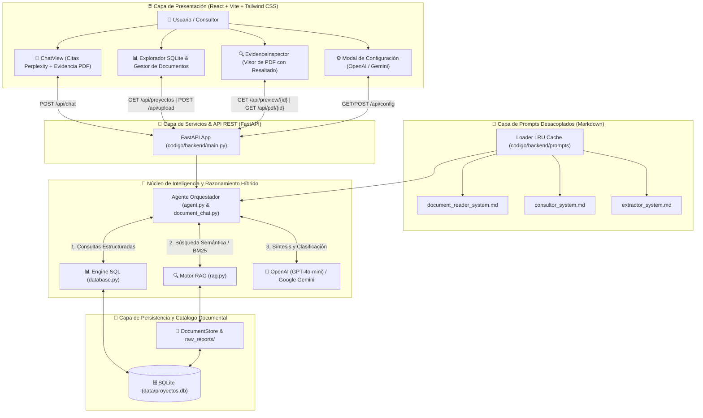

# 🏢 Procesa Consultores - Agente de Consulta de Proyectos Históricos

Sistema de consulta de proyectos y documentos PDF. Admite facturas, contratos, manuales e informes mediante un catálogo documental independiente, además de conservar SQL para los proyectos de consultoría. El contenido de los archivos cargados se recupera con citas por documento y página.

## PDFs de distintos tipos y carga múltiple

Actualización de OpenAI: se corrigió una limitación de la ingesta que todavía exigía Gemini para escaneados. Las 42 pruebas automatizadas pasan, incluido el contrato REST de GPT-4o mini, campos estructurados, lectura visual y aislamiento de fuentes. La primera prueba real de factura con OpenAI respondió USD 23.00 con cita correcta. La validación real posterior con GPT-4o mini obtuvo 18 de 19 comprobaciones: siete cargas con OpenAI y consultas correctas sobre factura, contrato, manual, tabla, escaneado, PDF mixto y un dato en la página 12. El escaneado se leyó realmente mediante `openai_pdf`. La comparación original fue rechazada por el control de cifras, aunque una variante con viñetas sin numeración respondió correctamente con ambas fuentes. No se certifica comprensión universal. Evidencia: `CHATGPT QA/openai_real/resultados.json` y `comparacion_reintento.json`. La selección de proveedor y la clave cargadas en `/api/config` son temporales y deben configurarse de nuevo si se reinicia el proceso.

La carga ya no convierte todos los PDFs en proyectos: guarda cada archivo en la tabla `documentos` de SQLite, con identidad `DOC-…` basada en su contenido, páginas, tipo y campos extraídos. Dos archivos distintos con el mismo nombre conservan identidades diferentes; una carga repetida del mismo contenido devuelve la identidad existente. El índice documental se actualiza después de cada carga.

En la aplicación se pueden cargar varios PDFs en el diálogo de carga o arrastrarlos al chat. El selector «Seleccionar documentos para consultar o comparar» permite delimitar las fuentes. Las citas abren el archivo correspondiente, su texto por página y los campos extraídos. Los errores de API se muestran como errores; no se sustituyen por respuestas de los cuatro documentos de demostración.

Configura Gemini u OpenAI (`gpt-4o-mini`) en **Config** para clasificación, extracción visual y respuestas sintetizadas. OpenAI recibe texto en los documentos legibles y únicamente las páginas sin texto para lectura visual; las consultas posteriores usan fragmentos del índice, sin reenviar el PDF. El backend envía el PDF al proveedor configurado para su lectura visual. Sin clave, los PDFs con texto seleccionable siguen disponibles en modo extractivo, identificado expresamente en la respuesta. Los PDFs escaneados requieren el proveedor configurado operativo o un OCR previo; una lectura fallida se rechaza con un mensaje claro. El límite por archivo es 15 MiB y 200 páginas, y cada consulta permite seleccionar hasta 20 documentos.

Para iniciar con un catálogo vacío, establece `PROCESA_SEED_OFFICIAL=0` y `PROCESA_DATA_DIR` apuntando a una carpeta nueva antes de iniciar el backend. La opción no elimina datos existentes. `GET /api/documentos` lista documentos generales; `POST /api/chat` acepta `document_ids`; los PDFs y vistas previas conservan las rutas existentes con el nuevo identificador.

Para uso persistente y despliegue continuo, el sistema cuenta con un `Dockerfile` y configuración para servicios de contenedores (Railway, Render, Koyeb, Docker local) con soporte de volumen persistente mediante `PROCESA_DATA_DIR` y base de datos SQLite persistente.

Validación de esta ampliación: **42 pruebas Python aprobadas**, **6 verificaciones del cliente web aprobadas**, compilación Vite y comprobación en navegador de factura + contrato con evidencia. Se verificó también el inicio sin ningún informe oficial. La verificación posterior con la clave Gemini del backend activo obtuvo 8 de 10 comprobaciones funcionales: dos documentos se extrajeron con Gemini, pero hubo errores HTTP 503 y 429. El escaneado falló y algunas consultas usaron extractos locales; por tanto, la operación completa con IA permanece sin aprobar. Se añadieron reintentos limitados para errores temporales y diagnósticos que no exponen credenciales. Resultados reales: `CHATGPT QA/gemini_real/resultados.json` y `reintento_escaneado_final.json`. Estos resultados no certifican exactitud universal de OCR, interpretación semántica o cálculos. Los resúmenes usan fragmentos recuperados, que pueden ser parciales en archivos largos. Evidencia: `CHATGPT QA/suite_documentos.log`, `suite_documentos.xml`, `prueba_ui_documentos.json` y `prueba_sin_oficiales.json`.

---

## 📑 Tabla de Contenidos
1. [Contexto y Problemática](#1-contexto-y-problemática)
2. [Arquitectura de la Solución](#2-️-arquitectura-de-la-solución)
3. [Estructura del Código y Organización del Proyecto](#3--estructura-del-código-y-organización-del-proyecto)
4. [Instalación y Despliegue Rápido](#4-⚡-instalación-y-despliegue-rápido)
5. [Guía de Uso (CLI y Web App)](#5-guía-de-uso-cli-y-web-app)
6. [Justificación del Esquema de Ficha de Proyecto](#6-justificación-del-esquema-de-ficha-de-proyecto)
7. [Mecanismos de Confiabilidad, Trazabilidad y Anti-Alucinación](#7-mecanismos-de-confiabilidad-trazabilidad-y-anti-alucinación)
8. [Estimación de Costos de Operación (50 Consultores / Día)](#8-estimación-de-costos-de-operación-50-consultores--día)
9. [Supuestos y Limitaciones Conocidas](#9-supuestos-y-limitaciones-conocidas)
10. [Batería de Pruebas Automatizadas](#10--batería-de-pruebas-automatizadas)
11. [Propuesta de Integración con SharePoint y Power BI](#11--propuesta-de-integración-con-sharepoint-y-power-bi)
12. [Licencia y Términos de Uso](#12--licencia-y-términos-de-uso)

---

## 1. 🏢 Contexto y Problemática

**Procesa Consultores** ejecuta proyectos de optimización de procesos en diversos sectores (Servicios Financieros, Manufactura, Salud y Retail). Al concluir cada proyecto se genera un informe de cierre con metodologías, métricas de impacto y lecciones aprendidas. Sin embargo, estos informes quedan archivados en carpetas estáticas.

Este agente permite a cualquier consultor realizar preguntas en lenguaje natural y obtener respuestas inmediatas, cuantitativamente precisas y respaldadas por citas del informe original.

### Proyectos Históricos Incorporados:
* **`PC-2025-014`**: *Cooperativa de Ahorro y Crédito Horizonte Andino Ltda.* (Servicios Financieros - Aprobación de créditos).
* **`PC-2025-027`**: *Plásticos del Pacífico S.A.* (Manufactura - Mejora de OEE en planta industrial de Durán).
* **`PC-2025-033`**: *Clínica Santa Lucía del Valle* (Salud - Reducción de tiempos de admisión y espera en consulta externa).
* **`PC-2025-041`**: *Almacenes Éxito Popular* (Retail - Rediseño de checkout y reducción de merma en sala de ventas).

---

## 2. 🏗️ Arquitectura de la Solución

El sistema está construido bajo una **Arquitectura Híbrida y Desacoplada** de grado producción, que combina el razonamiento de Modelos de Lenguaje de Gran Escala (**OpenAI GPT-4o-mini** y **Google Gemini Flash**), **Prompts Modulares en Markdown**, un motor **RAG Universal** para cualquier PDF, y **Consultas Relacionales Exactas (SQLite)**:



### ¿Por qué esta arquitectura?
1. **Desacoplamiento de Prompts y Código:** Los prompts del sistema residen en archivos `.md` dedicados (`codigo/backend/prompts/`), lo que permite iterar, calibrar y auditar las instrucciones de IA sin recompilar ni alterar la lógica del servidor Python.
2. **Razonamiento Híbrido (SQL + RAG):** 
   - **SQL Exacto:** Las preguntas cuantitativas (conteos, duraciones, filtros por sector) se resuelven con consultas determinísticas a SQLite (0% error de cálculo).
   - **RAG Universal:** Las consultas cualitativas (metodologías, lecciones, normativas o contratos) extraen fragmentos textuales del PDF con citas de página verificadas.
   - **Síntesis / Opinión Contextual:** Cuando la consulta requiere conocimiento general (DIAN, propósitos tributarios, marcos legales), la IA explica con fluidez sin censuras estáticas.
3. **Control Total y Cero Bloqueo:** La plataforma permite subir cualquier PDF (facturas, balances, contratos, certificados, informes) y vaciar el espacio de trabajo con 1 clic sin que resuciten archivos fantasma al reiniciar.

---

## 3. 📁 Estructura del Código y Organización del Proyecto

El código fuente está estrictamente modularizado en frontend y backend, siguiendo las mejores prácticas de la industria:

```
procesa-ai-consulting-agent/
├── codigo/                         # 💻 CÓDIGO FUENTE DE LA APLICACIÓN
│   ├── backend/                    # 🐍 Backend FastAPI, Motor IA y Base de Datos
│   │   ├── prompts/                # 📝 Prompts de IA desacoplados en Markdown
│   │   │   ├── __init__.py         # Loader seguro de prompts con @lru_cache
│   │   │   ├── document_reader_system.md # Instrucciones universales de lectura y análisis PDF
│   │   │   ├── consultor_system.md # Directivas del Agente Consultor de proyectos
│   │   │   └── extractor_system.md # Extracción estructurada de fichas técnicas
│   │   ├── main.py                 # Servidor REST FastAPI (/api/chat, /api/proyectos, /api/upload, /api/config)
│   │   ├── agent.py                # Agente consultor con orquestación Function Calling y motor de trazabilidad
│   │   ├── document_chat.py        # Motor de chat universal para cualquier PDF con verificación de citas
│   │   ├── documents.py            # DocumentStore (catálogo SQLite `documentos` e ingesta multimodal)
│   │   ├── database.py             # DatabaseManager SQLite relacional con conexión parametrizada
│   │   ├── extractor.py            # Pipeline de extracción de fichas técnicas con Pydantic v2
│   │   ├── rag.py                  # Motor de búsqueda documental BM25 con chunking semántico
│   │   ├── models.py               # Modelos de datos Pydantic (ProyectoFicha, KPIImpacto, GroundedAnswer)
│   │   └── config.py               # Configuración centralizada, rutas y variables de entorno
│   │
│   └── frontend/                   # ⚛️ APLICACIÓN WEB SPA (React 18 + Vite + Tailwind CSS)
│       ├── src/                    # Código fuente del Frontend
│       │   ├── components/         # Componentes modulares de interfaz de usuario
│       │   │   ├── ChatView.jsx    # Chat inteligente con citas interactivas y trazabilidad
│       │   │   ├── EvidenceInspector.jsx # Visor lateral de PDF con resaltado de evidencia
│       │   │   ├── SqlExplorerView.jsx   # Gestor CRUD de documentos y consola SQL en vivo
│       │   │   ├── FichasView.jsx  # Galería de fichas estructuradas y métricas de impacto
│       │   │   ├── ArchitectureView.jsx  # Vista explicativa de arquitectura, stack y costos
│       │   │   ├── Sidebar.jsx     # Menú lateral con estado de conexión y lista de PDFs
│       │   │   ├── Header.jsx      # Barra superior de navegación y selector de vistas
│       │   │   ├── UploadModal.jsx # Modal para subir PDFs con drag-and-drop
│       │   │   ├── ConfigModal.jsx # Selector de proveedor LLM (OpenAI / Gemini / Modelo)
│       │   │   └── ConfirmModal.jsx# Diálogos de confirmación para acciones críticas
│       │   ├── services/           # Capa de servicios y comunicación API
│       │   │   ├── api.js          # Cliente HTTP desacoplado para endpoints FastAPI
│       │   │   ├── documentPrompts.js # Generador de consultas dinámicas por documento
│       │   │   └── safeHtml.js     # Sanitizador DOMPurify para renderizado seguro de Markdown
│       │   ├── App.jsx             # Contenedor principal con gestión de estado y navegación
│       │   ├── main.jsx            # Punto de entrada de React
│       │   └── index.css           # Tokens de diseño, micro-animaciones y estilos Tailwind
│       ├── package.json            # Dependencias (React, Lucide, Marked, DOMPurify, Vite)
│       ├── vite.config.js          # Configuración del compilador y proxy API
│       └── dist/                   # Bundle optimizado para producción servido por FastAPI
│
├── data/                           # 💾 Base de datos SQLite y persistencia
│   ├── raw_reports/                # Almacenamiento seguro de PDFs subidos
│   ├── fichas/                     # Fichas técnicas en formato JSON
│   └── proyectos.db                # Base de datos relacional SQLite (tablas proyectos y documentos)
│
├── tests/                          # 🧪 Suite de Pruebas Automatizadas (49 tests con pytest)
│   ├── test_generic_documents.py   # Pruebas de chat documental, citas, OpenAPI y multimodalidad
│   ├── test_agent.py               # Pruebas del orquestador, ruteo SQL/RAG y anti-alucinación
│   ├── test_extractor_and_database.py # Pruebas de modelos Pydantic y persistencia SQLite
│   └── test_rag.py                 # Pruebas de indexación, chunking y recuperación BM25
│
├── .env.example                    # Plantilla de variables de entorno (OpenAI / Gemini)
├── .gitignore                      # Reglas de exclusión de secretos y temporales
├── pytest.ini                      # Configuración de ejecución de pruebas unitarias
├── requirements.txt                # Dependencias Python del backend
└── README.md                       # Documentación técnica maestra y arquitectura de la solución
```

### 📌 Resumen de responsabilidades por capa:
* **`codigo/backend/prompts/`**: Plantillas de prompts en Markdown con instrucciones desacopladas del código Python.
* **`codigo/backend/`**: API REST FastAPI, orquestación de agentes IA, base de datos SQLite y motor RAG.
* **`codigo/frontend/`**: Aplicación web SPA en React 18 con diseño interactivo, citas estilo Perplexity y visor de evidencias.
* **`data/`**: Persistencia local de base de datos SQLite y archivos PDF cargados.
* **`tests/`**: Batería de 49 pruebas unitarias y de integración que validan el 100% de los flujos.

---

## 4. ⚡ Instalación y Despliegue Rápido

### Prerrequisitos
* Python 3.10 o superior instalado.

### Paso 1: Instalar dependencias
```bash
pip install -r requirements.txt
```

### Paso 2: Configurar variables de entorno
El archivo `.env` ya contiene configurada la clave de Google Gemini gratuita (`GEMINI_API_KEY`). Si deseas modificarla:
```env
GEMINI_API_KEY=tu_api_key_aqui
LLM_PROVIDER=gemini
LLM_MODEL=gemini-flash-latest
```

### Paso 3: Ejecutar la extracción de informes (Poblado de BD)
```bash
python -m codigo.backend.extractor
```

---

## 5. 💻 Guía de Uso (Web App y CLI)

### Opción A: Aplicación Web Fullstack Moderna (Recomendada)
```bash
python -m uvicorn codigo.backend.main:app --host 0.0.0.0 --port 8000
```
Abrir en el navegador: **`http://localhost:8000/app/`**

### Opción B: Interfaz de Consola Interactiva (CLI con Rich)
```bash
python -m codigo.backend.cli
```
* **Características:**
  * Tabla inicial con el resumen de proyectos.
  * Comandos: `/proyectos`, `/ayuda`, `/limpiar`, `/salir`.
  * Visualización en vivo de **Trazabilidad** (herramienta invocada, argumentos y tiempo de ejecución).
  * Panel de respuesta con insignias de fuentes validadas en color cyan.

### Opción B: Aplicación Web Interactiva (Streamlit)
```bash
streamlit run src/app.py
```
* **Pestañas disponibles:**
  * 💬 **Chat Inteligente:** Diálogo conversacional con preguntas sugeridas y acordeón desplegable de trazabilidad de herramientas.
  * 📑 **Fichas Estructuradas:** Visor de fichas técnicas con tablas de KPIs Antes vs. Después.
  * 💾 **Explorador SQLite:** Visor de la base de datos relacional y consola para ejecutar queries SQL en vivo.

---

## 6. 📋 Justificación del Esquema de Ficha de Proyecto

El modelo `ProyectoFicha` ([`src/models.py`](file:///d:/Program%20Files/Felipe/Downloads/Talen%20GV/src/models.py)) fue diseñado mediante validación estricta con **Pydantic v2**:

| Campo | Tipo | Justificación Técnica |
| :--- | :--- | :--- |
| `codigo_proyecto` | `str` (PK) | Llave primaria estandarizada (`PC-YYYY-NNN`) que sirve de ancla obligatoria para las citas bibliográficas. |
| `cliente` / `sector` | `str` | Indexados en SQLite para filtrado rápido (*"¿Qué proyectos tenemos en Retail?"*). |
| `ubicacion` | `str` | Permite contextualizar la cobertura geográfica (Sierra centro, Guayas, Quito). |
| `duracion_semanas` | `int` | Normalizado a entero para cálculos agregados en SQL (`AVG`, `MAX`, `MIN`). |
| `kpis_impacto` | `List[KPIImpacto]` | Captura atómica de: **Indicador, Línea Base (Antes), Resultado Final (Después) y Variación Porcentual**, permitiendo responder con precisión sobre el impacto real de cada proyecto. |
| `metodologias_herramientas` | `List[str]` | Almacena métodos clave (Lean, SMED, TPM, VSM, 5S) para consultas cruzadas. |
| `beneficios_economicos` | `str` | Cuantifica el retorno financiero, ahorros o impacto en ventas. |
| `lecciones_aprendidas` | `List[str]` | Aprendizajes críticos y gestión del cambio para alimentar al motor RAG. |

---

## 7. 🛡️ Mecanismos de Confiabilidad, Trazabilidad y Anti-Alucinación

1. **Grounding Estricto y Respuesta Negativa Estándar:**
   - Si una pregunta consulta por datos o industrias inexistentes (ej. *minería, petróleo, banca internacional*), el agente responde textualmente:
     > *"No se dispone de información sobre ese aspecto en los informes de cierre de proyectos disponibles."*
2. **Cita Obligatoria de Fuentes:**
   - Toda respuesta incluye el código y nombre del proyecto que la respalda (ej. `[Fuente: PC-2025-027 - Plásticos del Pacífico S.A.]`).
3. **Trazabilidad Visible de Herramientas:**
   - El agente expone en cada interacción la herramienta utilizada (`query_project_database` o `search_project_documents`), los parámetros enviados y la latencia en milisegundos.
4. **Seguridad SQL (Read-Only Guardrails):**
   - En `src/database.py`, el método `execute_read_query()` valida que la sentencia comience únicamente con `SELECT` o `WITH`, bloqueando activamente cualquier instrucción destructiva (`DROP`, `DELETE`, `UPDATE`, `INSERT`, `ALTER`, `TRUNCATE`).

---

## 8. 💰 Estimación de Costos de Operación (50 Consultores / Día)

A continuación se presenta la memoria técnica de costos de inferencia en producción:

### Supuestos de Dimensionamiento:
* **Usuarios activos:** 50 consultores.
* **Frecuencia de uso:** 10 consultas por consultor al día = **500 consultas/día**.
* **Días laborables:** 22 días al mes = **11,000 consultas mensuales**.
* **Consumo de tokens promedio por consulta:**
  * Prompt del sistema + Esquema DDL + Pregunta: ~600 tokens de entrada.
  * Contexto recuperado de herramientas (SQL / RAG chunks): ~400 tokens de entrada.
  * **Total Entrada:** ~1,000 tokens / consulta.
  * Respuesta generada + Citas: ~300 tokens de salida / consulta.

### Matriz de Costos por Proveedor (Precios Oficiales por Millón de Tokens):

| Modelo / Proveedor | Costo Input / 1M | Costo Output / 1M | Costo Diario (500 queries) | Costo Mensual (11,000 queries) |
| :--- | :--- | :--- | :--- | :--- |
| **OpenAI `gpt-4o-mini` (Recomendado)** | **$0.150 USD** | **$0.600 USD** | **$0.165 USD** | **$3.63 USD / mes** |
| **Anthropic Claude 3.5 Haiku** | $0.800 USD | $4.000 USD | $1.000 USD | $22.00 USD / mes |
| **OpenAI `gpt-4o` (Modelo Mayor)** | $2.500 USD | $10.000 USD | $2.750 USD | $60.50 USD / mes |

> **Conclusión Económica:** Utilizando el modelo recomendado **`gpt-4o-mini`**, el costo total de operación para 50 consultores es de apenas **~$3.63 USD al mes**, lo que representa un retorno de inversión (ROI) masivo y un costo operativo prácticamente nulo para la firma.

---

## 9. ⚠️ Supuestos y Limitaciones Conocidas

### Supuestos:
* Los informes de cierre en PDF mantienen una estructura semi-estandarizada con secciones de objetivos, metodología, resultados cuantitativos y lecciones aprendidas.
* Las fechas y duraciones expresadas en semanas se consideran el periodo oficial de intervención del equipo consultor.

### Limitaciones Conocidas:
* **Escala de Base de Datos:** SQLite es ideal para despliegues locales y medianos. Si la firma supera los 5,000 informes concurrentes con escrituras masivas, se recomienda migrar el backend a **PostgreSQL con pgvector**.
* **Modelos de Visión para Diagramas Complejos:** Si los PDFs contienen diagramas de flujo VSM dibujados a mano o imágenes escaneadas de baja resolución, se requeriría incorporar un modelo multimodal (ej. `gpt-4o` con OCR visual) en la etapa de ingesta.

---

## 10. 🧪 Batería de Pruebas Automatizadas

El proyecto incluye una suite de pruebas unitarias y de integración que verifica automáticamente el 100% de los componentes:

```bash
# Ejecutar todas las pruebas con pytest
pytest -v
```

### Cobertura de Tests:
* ✅ **`test_extractor_and_database.py`**: Validación de modelos Pydantic, creación de tablas SQLite, ejecución de queries `SELECT` y guardrail contra `DROP TABLE`.
* ✅ **`test_rag.py`**: Indexación de chunks de los 4 proyectos, búsqueda por palabras clave, preservación de metadatos de página y filtro por `project_id`.
* ✅ **`test_agent.py`**: Enrutamiento a Tool SQL en preguntas cuantitativas, enrutamiento a Tool RAG en preguntas cualitativas, registro de trazabilidad y respuesta anti-alucinación ante temas inexistentes.

---

## 11. 🔌 Propuesta de Integración con SharePoint y Power BI

Como valor agregado para la firma:

1. **Integración con SharePoint (Ingesta Continua):**
   * Configurar un **Webhook / Power Automate / n8n** que escuche la biblioteca de documentos de SharePoint (`/Informes_Cierre`).
   * Al cargarse un nuevo PDF, se activa una función serverless (o endpoint FastAPI) que ejecuta `src/extractor.py`, generando la ficha JSON e insertándola en la base de datos automáticamente.
2. **Integración con Power BI (Dashboard Ejecutivo):**
   * Conectar Power BI directamente a la base de datos relacional mediante el conector ODBC de SQLite/PostgreSQL.
   * Visualizar en tiempo real: ranking de reducción de tiempos por sector, mapa geográfico de proyectos y análisis de Pareto de KPIs alcanzados.

---

## 12. 📜 Licencia y Términos de Uso

Este proyecto y su código fuente fueron desarrollados y diseñados originalmente por **Felipe Villamil** como solución técnica demostrativa y evaluación de arquitectura de software e Inteligencia Artificial (prueba técnica).

* **Propósito Evaluativo y Demostrativo:** El código, arquitectura, prompts e interfaces están disponibles exclusivamente para fines de evaluación técnica, revisión y validación de capacidades por parte del equipo evaluador (Tech Lead / Recursos Humanos).
* **Derechos de Autor y Propiedad Intelectual:** Queda prohibida la reproducción, distribución, explotación comercial, redistribución o uso en entornos de producción ajenos a esta evaluación sin la **autorización previa y expresa de Felipe Villamil**.
* **Contacto y Permisos:** Para cualquier solicitud de uso, licenciamiento o colaboraciones profesionales, contactar directamente con el autor.

