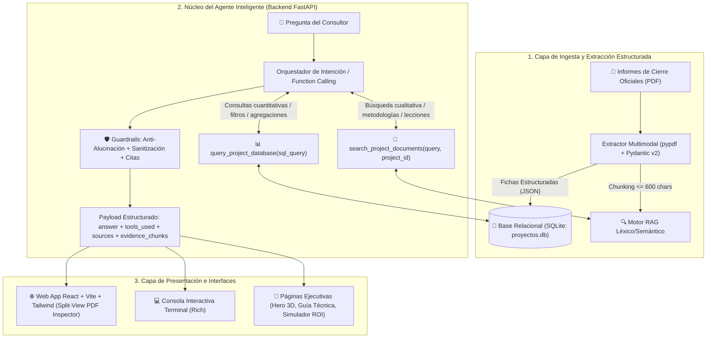

# Solución Técnica Oficial: Agente de Consulta de Proyectos (Procesa Consultores)

---

## 1. 🎯 Resumen Ejecutivo y Enfoque del Problema

El objetivo del proyecto es construir un **Asistente Inteligente de IA Consultora** para **Procesa Consultores**, capaz de responder con máxima fidelidad fáctica, cero alucinaciones y trazabilidad total sobre los informes de cierre de proyectos históricos.

### Decisiones Clave de Arquitectura:
1. **Solución 100% en Código Nativo (Python + React):** Se priorizó una arquitectura desacoplada y mantenible (FastAPI en Backend + React/Vite/Tailwind en Frontend + CLI en Rich) en lugar de herramientas No-Code cerradas, garantizando control total del flujo de Function Calling, seguridad y soporte para cambios en vivo durante entrevistas técnicas.
2. **Arquitectura Híbrida (SQL Relacional + RAG Semántico):** Separación explícita de responsabilidades:
   - **SQL Relacional (SQLite):** Consultas cuantitativas, agregaciones, promedios, conteos, ordenamientos y filtros por sector/fechas.
   - **RAG Semántico (Retrieval-Augmented Generation):** Búsqueda de contexto cualitativo, lecciones aprendidas, metodologías, causas de problemas y factores humanos.
3. **Grounding Verificado y Anti-Alucinación:** Abstención determinista (`found_info=False`) si una consulta carece de evidencia empírica en los documentos o si la base relacional retorna 0 filas.

---

## 2. 🏗️ Arquitectura Integral del Sistema

---

## 3. 📋 Esquema Relacional y Validación de Datos (Pydantic v2)

Cada proyecto se valida mediante modelos estructurados en [`models.py`](file:///d:/Program%20Files/Felipe/Downloads/Talen%20GV/codigo/backend/models.py) y se persiste en SQLite:

| Campo | Tipo | Restricción / Validación | Descripción |
| :--- | :--- | :--- | :--- |
| `codigo_proyecto` | `VARCHAR(20)` | Primary Key | Código único oficial (ej. `PC-2025-014`). |
| `cliente` | `VARCHAR(150)` | Not Null | Nombre legal de la empresa cliente. |
| `sector` | `VARCHAR(100)` | Not Null | Industria (Servicios financieros, Manufactura, Salud, Retail). |
| `ubicacion` | `VARCHAR(150)` | Not Null | Ubicación geográfica o red de agencias. |
| `fecha_inicio` | `VARCHAR(10)` | ISO 8601 (`YYYY-MM-DD`) | Fecha de inicio del proyecto. |
| `fecha_fin` | `VARCHAR(10)` | ISO 8601 (`YYYY-MM-DD`) | Fecha de cierre del proyecto. |
| `duracion_semanas` | `INTEGER` | `ge=0` (Mayor o igual a 0) | Duración para cálculos analíticos y promedios. |
| `gerente_proyecto` | `VARCHAR(150)` | Not Null | Gerente responsable de Procesa Consultores. |
| `objetivo_general` | `TEXT` | Not Null | Propósito principal y alcance de la consultoría. |
| `metodologias_herramientas` | `JSON TEXT` | Lista de strings | Herramientas (Lean, SMED, TPM, VSM, etc.). |
| `kpis_impacto` | `JSON TEXT` | Lista de objetos KPI | Pares numéricos (Línea Base Inicial vs. Resultado Final). |
| `beneficios_economicos` | `TEXT` | Not Null | Ahorro cuantificado o declaración de no monetización. |
| `lecciones_aprendidas` | `JSON TEXT` | Lista de strings | Aprendizajes críticos y factores de cambio. |
| `factores_riesgo` | `JSON TEXT` | Lista de strings | Riesgos operativos y mitigaciones. |

---

## 4. 🛠️ Herramientas del Agente (Function Calling)

El agente expone dos herramientas con JSON Schema estricto compatibles con OpenAI y Google Gemini:

### 1. `query_project_database(sql_query: str)`
* **Propósito:** Ejecución de consultas `SELECT` sobre SQLite para responder preguntas cuantitativas, comparativas o de agregación.
* **Seguridad:** Motor de validación que bloquea mutaciones (`DROP`, `DELETE`, `UPDATE`, `INSERT`, `ALTER`, `ATTACH`, `PRAGMA`), bloquea múltiples sentencias separadas por punto y coma, y permite de forma segura literales con comillas simples (ej. `SELECT 'UPDATE' AS estado`).

### 2. `search_project_documents(query: str, project_id: Optional[str] = None)`
* **Propósito:** Búsqueda sobre el corpus textual de los informes de cierre.
* **Chunking Semántico:** Fragmentación con límite estricto de $\le 600$ caracteres por chunk, preservando número de página y proyecto de procedencia.
* **Filtro por Proyecto:** Permite restringir la búsqueda a un informe específico cuando la intención del usuario lo requiere.

---

## 5. 🛡️ Guardrails, Citas y Trazabilidad de Extremo a Extremo

1. **Abstención Fáctica (Anti-Alucinación):**
   - Si la consulta refiere a sectores no cubiertos (ej. *minería, petróleo, agricultura, telecomunicaciones*) o códigos inexistentes, el sistema responde explícitamente que no se dispone de información en los informes disponibles y marca `found_info=False`.
   - Si la herramienta SQL retorna 0 filas o el LLM no invoca herramientas, no se sintetizan datos ficticios.
2. **Trazabilidad Completa:** Cada respuesta incluye:
   - `tools_used`: Nombre de herramienta, argumentos enviados, resumen del resultado y tiempo de ejecución en milisegundos (`ms`).
   - `sources`: Códigos de proyectos citados.
   - `evidence_chunks`: Fragmentos textuales exactos con número de página y texto fuente.
3. **Inspector de Evidencia en Frontend:** Panel en pantalla dividida (Split-View) que permite alternar entre el texto del chunk RAG, la ficha técnica del proyecto y el visor PDF embebido.

---

## 6. 🌐 Interfaces de Usuario Implementadas

1. **Aplicación Web React + Vite + Tailwind CSS:**
   - Chat inteligente con sugerencias adaptativas y citas interactivas.
   - Explorador relacional SQLite con consola interactiva y operaciones CRUD (subida de PDFs nuevos, borrado y restauración).
   - Panel de Fichas Estructuradas con visualización de KPIs antes/después.
   - Modal de configuración dinámica de IA (API Keys, selector de modelos Gemini/OpenAI y slider de temperatura).
2. **Páginas Ejecutivas de Apoyo:**
   - `/inicio.html` / `/nival.html`: Presentación Hero 3D de la plataforma.
   - `/guia.html`: Guía técnica y de arquitectura del sistema.
   - `/solucion.html`: Demostración interactiva y simulador de ROI para consultoría.
3. **Consola CLI Interactiva (Rich):**
   - Interfaz por terminal con tablas estilizadas, paneles de trazabilidad y diálogo continuo.

---

## 7. 🧪 Estrategia de Pruebas y Calidad de Software (Testing)

El sistema cuenta con una suite completa de pruebas automatizadas con **Pytest** para garantizar robustez, mantenibilidad y fidelidad fáctica:

1. **Pruebas de Ingesta y Validación de Datos (`test_extractor_and_database.py`):**
   - Comprobación de existencia de las fichas JSON y base SQLite.
   - Validación del modelo Pydantic (`ProyectoFicha`) rechazando duraciones negativas o esquemas inválidos.
   - Verificación de guardrails de seguridad en SQLite (bloqueo de sentencias `DROP`, `DELETE`, `UPDATE`, mutaciones y multi-statements).
2. **Pruebas de Búsqueda RAG (`test_rag.py`):**
   - Indexación correcta de fragmentos con longitud $\le 600$ caracteres.
   - Recuperación de términos clave (ej. *SMED, OEE, resistencia al cambio, mandos medios*).
   - Filtrado estricto por `project_id` sin contaminación entre proyectos.
3. **Pruebas del Agente y Anti-Alucinación (`test_agent.py`):**
   - Enrutamiento inteligente a SQL ante preguntas analíticas y a RAG ante consultas narrativas.
   - Trazabilidad y registro de `tools_used`.
   - Abstención verificada ante dominios o sectores no soportados (*minería, petróleo, agricultura, telecomunicaciones*).
4. **Fidelidad Documental del Corpus Oficial:**
   - Fechas de inicio/fin y duraciones en semanas (21, 23, 21, 25; promedio de 22.5 semanas).
   - Asignación correcta de gerentes de proyecto (Ing. Daniela Cevallos e Ing. Martín Aguirre).
   - Coincidencia exacta de los 22 pares de indicadores de impacto (Línea Base vs. Resultado Final).

---

## 8. 💰 Desglose Económico y Costo por Consulta en Producción

* **Modelo Base:** `gpt-4o-mini` / `gemini-flash-latest`.
* **Volumen Estimado:** 50 consultores × 10 consultas/día = 500 consultas/día ($\approx$ 11,000 consultas/mes).
* **Consumo Medio por Consulta:** 850 tokens de entrada (Prompt + Esquema + Historial) / 250 tokens de salida.
* **Costo Mensual Estimado:** **$1.15 a $3.50 USD al mes**, demostrando una solución altamente rentable y escalable para la firma.
