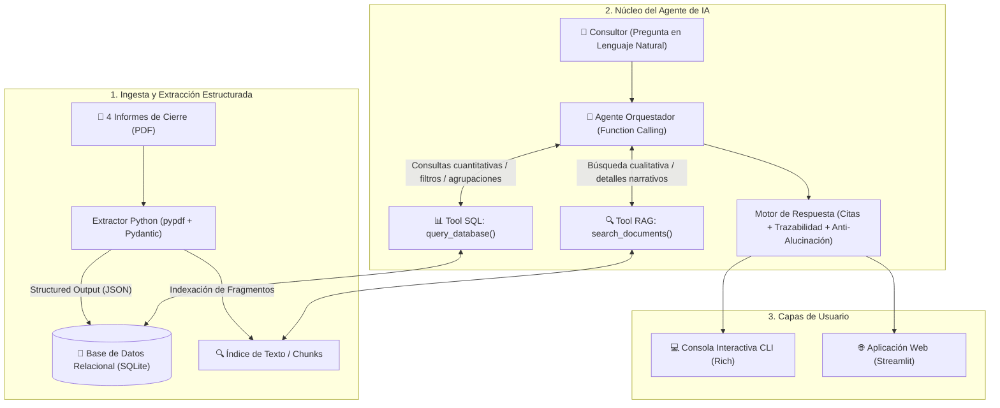

# Solución Técnica: Agente de Consulta de Proyectos (Procesa Consultores)

---

## 1. ⚠️ Aclaración Inicial: ¿Por qué NO usar n8n como solución principal?

Aunque herramientas No-Code/Low-Code como **n8n** o **Power Automate** permiten armar flujos rápidos, **NO son viables como solución central** para esta prueba técnica por las siguientes razones:

1. **Requisito Obligatorio de Lenguaje:** El enunciado oficial exige explícitamente: *"Construir un agente en Python que responda preguntas sobre los cuatro proyectos"*.
2. **Evaluación de Código y Git (20% de la nota):** La rúbrica evalúa la calidad de la arquitectura de software, tipado, modularidad y un historial de commits en Git.
3. **Prueba de "Cambio en Vivo" en la entrevista (15% de la nota):** En la sesión de 45 minutos se pedirá modificar la lógica del agente en tiempo real frente a los evaluadores. Un backend en Python permite hacer ajustes en segundos con total control.
4. **Rol de n8n:** El documento solo menciona n8n como un *punto adicional/opcional* para automatizar la ingesta de archivos nuevos, no para el agente en sí.

> **Conclusión:** La solución estándar y definitiva se construirá **100% en Python** con arquitectura modular.

---

## 2. 🏗️ Arquitectura de la Solución (100% Python)

El sistema se compone de 3 capas claramente desacopladas:

---

## 3. 📋 Esquema de la Ficha de Proyecto (Pydantic / SQLite)

Cada informe se procesará y almacenará en una tabla relacional con campos estandarizados:

| Campo | Tipo | Descripción y Justificación |
| :--- | :--- | :--- |
| `codigo_proyecto` | `VARCHAR(20)` (PK) | Código único (ej. `PC-2025-014`). |
| `cliente` | `VARCHAR(150)` | Nombre de la empresa cliente. |
| `sector` | `VARCHAR(100)` | Industria (Servicios financieros, Manufactura, Salud, Retail). |
| `ubicacion` | `VARCHAR(150)` | Ciudad / Región donde se ejecutó el proyecto. |
| `fecha_inicio` / `fecha_fin` | `DATE` / `VARCHAR` | Fechas de inicio y cierre. |
| `duracion_semanas` | `INTEGER` | Duración para cálculos analíticos (promedios, máximos). |
| `gerente_proyecto` | `VARCHAR(150)` | Responsable del equipo consultor. |
| `objetivo_general` | `TEXT` | Meta principal del proyecto. |
| `metodologias` | `TEXT` (JSON) | Metodologías aplicadas (Lean Healthcare, SMED, 5S, etc.). |
| `kpis_impacto` | `TEXT` (JSON) | Métricas numéricas clave con valor Inicial vs. Final. |
| `beneficios_economicos` | `TEXT` | Ahorros o retorno financiero obtenido. |
| `lecciones_aprendidas` | `TEXT` | Factores clave, dificultades y recomendaciones. |

---

## 4. 🛠️ Herramientas del Agente (Tools)

El agente contará con dos herramientas bien tipadas para que el LLM decida autónomamente cuál ejecutar:

1. **`query_project_database(sql_query: str) -> str`**
   * Ejecuta consultas `SELECT` sobre SQLite.
   * Ideal para preguntas tipo: *"¿Cuántos proyectos hicimos en 2025?", "¿Cuál es el proyecto de mayor duración?", "¿En qué sectores tenemos experiencia?"*.
   * Incluye validación de seguridad (solo lectura).

2. **`search_project_documents(query: str, project_id: Optional[str]) -> str`**
   * Búsqueda en el texto completo de los informes divididos por secciones.
   * Ideal para preguntas tipo: *"¿Qué problemas de liderazgo hubo en la clínica?", "¿Cómo se capacitó al personal de planta?", "¿Qué lecciones aprendidas aplican a compras?"*.

---

## 5. 🎯 Confiabilidad, Citas y Trazabilidad

* **Anti-Alucinación:** Si un dato no figura en la base de datos ni en los informes, el agente responderá explícitamente: *"No se dispone de información sobre ese aspecto en los informes de cierre disponibles"*.
* **Citas Obligatorias:** Toda respuesta incluirá la referencia exacta al proyecto de origen (ej. `[Fuente: PC-2025-027 - Plásticos del Pacífico S.A.]`).
* **Trazabilidad:** La interfaz mostrará en pantalla qué herramienta invocó el agente, qué parámetros envió y qué resultado obtuvo antes de formular la respuesta final.

---

## 6. 💻 Interfaces

1. **CLI (Terminal con Rich):** Consola elegante con paneles de colores, historial y trazabilidad visible.
2. **Web (Streamlit):** Chat interactivo + visualizador de fichas y visor de la base de datos.

---

## 7. 🧪 Pruebas Automatizadas (Pytest)

Suite de tests para verificar automáticamente:
* Parseo de los 4 PDFs y validación de esquemas con Pydantic.
* Ejecución correcta de consultas SQL.
* Recuperación de fragmentos relevantes con RAG.
* Respuestas correctas del agente ante preguntas de prueba.

---

## 8. 💰 Estimación de Costos (50 Consultores / Día)

* **Supuesto:** 50 consultores × 10 consultas al día = 500 consultas/día (~11,000 consultas/mes).
* **Consumo promedio por consulta:** ~800 tokens entrada / ~300 tokens salida.
* **Costo mensual estimado (OpenAI `gpt-4o-mini`):** **Entre $3.00 y $5.00 USD al mes**, demostrando alta viabilidad financiera.
